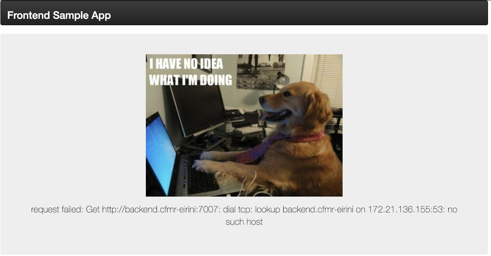
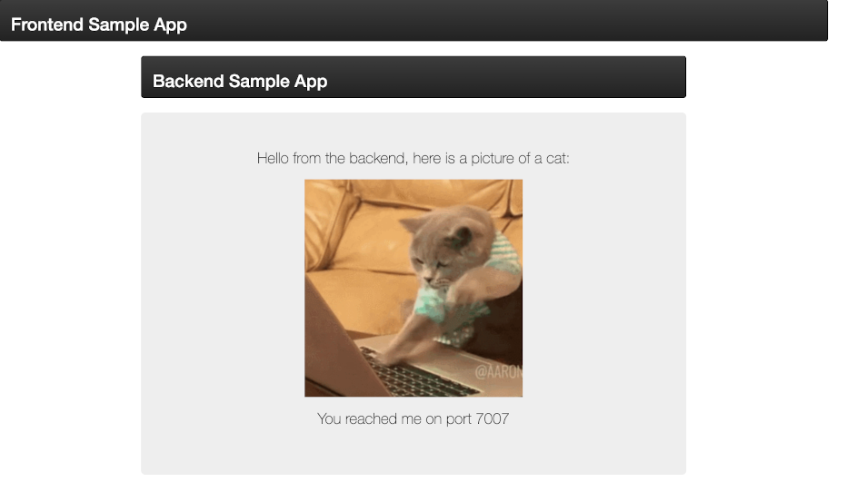
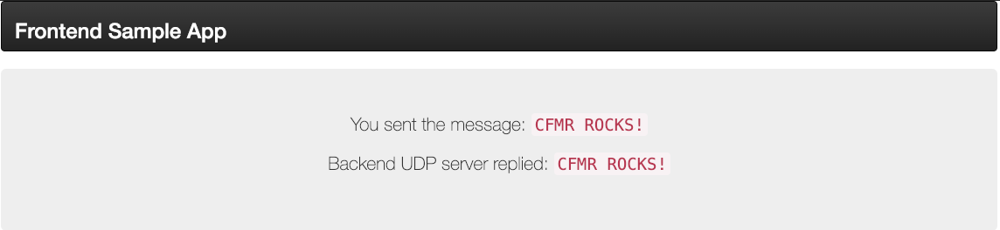

## C2C - Container to Container Networking

The container-to-container networking feature enables app instances to communicate with each other directly.  


#### Architecture 
The CFMR broker acts as an ideal bridge for CF Devs to express network connectivity requirements that can then be translated into appropriate Kubernetes resources to enact.  For container-to-container networking, three K8s resources are of interest:

- **selectors** (pod): Via a label selector, the client/user can identify a set of objects. The label selector is the core grouping primitive in Kubernetes.  For the C2C implementation, we are using an equality based selector to ensure a Cloud Foundry `SOURCE-APP GUID` is matched to its desired `TARGET-APP GUID`.

- **service** (svc) : In Kubernetes, a Service is an abstraction which defines a logical set of Pods and a policy by which to access them (sometimes this pattern is called a micro-service). The set of Pods targeted by a Service is usually determined by a selector.

 >Kubernetes Pods are created and destroyed to match the state of your cluster. Pods are nonpermanent resources. If you use a Deployment to run your app, it can create and destroy Pods dynamically.

 >Each Pod gets its own IP address, however in a Deployment, the set of Pods running in one moment in time could be different from the set of Pods running that application a moment later.

 >This leads to a problem: if some set of Pods (call them "backends") provides functionality to other Pods (call them "frontends") inside your cluster, how do the frontends find out and keep track of which IP address to connect to, so that the frontend can use the backend part of the workload?
 
 >Enter Services.
 
 >source: [https://kubernetes.io/docs/concepts/services-networking/service/](https://kubernetes.io/docs/concepts/services-networking/service/)

 	
- **networkpolicy** : If you want to control traffic flow at the IP address or port level (OSI layer 3 or 4), then you might consider using Kubernetes NetworkPolicies for particular applications in your cluster. NetworkPolicies are an application-centric construct which allow you to specify how a pod is allowed to communicate with various network "entities".  When defining a pod- or namespace- based NetworkPolicy, you use a selector to specify what traffic is allowed to and from the Pod(s) that match the selector.

For more information about K8s concepts: [https://kubernetes.io/docs/](https://kubernetes.io/docs/)

#### Enabling

To enable this service within the CFMR broker, complete the following steps:

1. List Service Plans for the CFMR Broker

 ```
▶ cf service-access -b cfmr-broker
Getting service access for broker cfmr-broker as admin...
broker: cfmr-broker
   service              plan          access   orgs
   network-policy       c2c           none
   p-rabbitmq           single        all
   p-rabbitmq           standard      all
   p-redis              small-cache   all
   p-service-registry   standard      all
   p.config-server      standard      all
   p.mysql              db-small      all
   scheduler            appstate      none
```

2. Enable service-access to the c2c plan
 
 ```
 ▶ cf enable-service-access network-policy -p c2c
Enabling access of plan c2c for service network-policy as admin...
OK
 ```
 
3. Creation of a service instance using the `c2c` plan will create two resources (service and networkpolicy) within the `cfmr-eirini` namespace that are specifically configured to facilitate direct communication between the deployed applications.  They use the APP-GUID as a pod selector to ensure proper mapping. For testing purposes, we will use the legacy **Cats and Dogs without Service Discovery** sample ([https://github.com/cloudfoundry-attic/cf-networking-examples/blob/master/docs/c2c-no-service-discovery.md](https://github.com/cloudfoundry-attic/cf-networking-examples/blob/master/docs/c2c-no-service-discovery.md))

 >The Cats and Dogs example demonstrates communication (HTTP and UDP) between a frontend and a backend application over the container network.
 >The frontend allows you to test out container network communication via two methods:

 > - connect to the backend via HTTP
 > - connect to the backend via UDP
 
 > In either case, the response from the backend to the frontend will be rendered as a web page.  With NO CFMR c2c plan based service instance created, attempting to connect from the frontend to the backend via HTTP on the 7007, 7008 or 7009 ports will result in a connection is refused or no such host error.  Similar for UDP.
 
 > 
 
 1. To create a service instance, execute the following command with its custom JSON payload.
 
    ```SOURCEAPP=frontend;DESTAPP=backend; cf create-service network-policy c2c front2back -c '{"source-guid":"'$(cf app "${SOURCEAPP}" --guid)'","destination-appname":"'"${DESTAPP}"'","destination-guid":"'$(cf app "${DESTAPP}" --guid)'","ports":[{"name":"cat1","port":7007,"targetport":7007,"protocol":"tcp"},{"name":"cat2","port":7008,"targetport":7008,"protocol":"TCP"},{"name":"cat2a","port":7009,"targetport":7009,"protocol":"TCP"},{"name":"cat3","port":9001,"targetport":9001,"protocol":"udp"},{"name":"cat4","port":9002,"targetport":9002,"protocol":"UDP"},{"name":"cat4a","port":9003,"targetport":9003,"protocol":"UDP"}]}'```
 
 2. To validate on the backend within OpenShift, you can identify and inspect the resulting networkpolicy and service resources generated.
 
     ```
     ▶ oc get svc,networkpolicy -n cfmr-eirini
     NAME              TYPE        CLUSTER-IP      EXTERNAL-IP   PORT(S)                                                 AGE
     service/backend   ClusterIP   172.21.123.93   <none>        7007/TCP,7008/TCP,7009/TCP,9001/UDP,9002/UDP,9003/UDP   11d
     NAME                                                   POD-SELECTOR                                                     AGE
     networkpolicy.networking.k8s.io/c2c-x105i4k5-backend   cloudfoundry.org/app_guid=cb203632-efaf-47f1-ae65-68b856a28c6f   11d``` 
 
 3. Now attempt to connect from the frontend to the backend via HTTP on the 7007, 7008 or 7009 ports.<br/>(e.g. `backend.cfmr-eirini:9002`) The backend will render a typing cat ...
 
 
 4. The UDP echo server will now also echo your text back successfully using ports 9001-9003 <br/>(e.g. `backend.cfmr-eirini:9002`)
     
    
---
## Scheduler - Application State Toggling (Start/Stop)

Scheduler is a service for scheduling the starting and stopping of CFMR applications.  This is useful for reasons of security, cost savings and general resource loading.

#### Architecture 
The CFMR broker acts as an ideal bridge for CF Devs to express network connectivity requirements that can then be translated into appropriate Kubernetes resources to enact.  For scheduler, one K8s resources is of interest:

- **cronjob** : A CronJob creates Jobs on a repeating schedule.  One CronJob object is like one line of a crontab (cron table) file. It runs a job periodically on a given schedule, written in Cron format. CronJobs are useful for creating periodic and recurring tasks, like running backups or sending emails. CronJobs can also schedule individual tasks for a specific time, such as scheduling a Job for when your cluster is likely to be idle.

The basic approach is to create a pair of cronjobs that obtain a token and invoke the internal CF API for updating an applications state between `STARTING` and `STOPPING`.  The credentials used for this toggling activity is customizable and leverages a k8s secret.  This credential set must have visibility across orgs/spaces who are enabled for this service.

#### Enabling

To enable the scheduler service within the CFMR broker, complete the following steps:

1. List Service Plans for the CFMR Broker

 ```
▶ cf service-access -b cfmr-broker
Getting service access for broker cfmr-broker as admin...
broker: cfmr-broker
   service              plan          access   orgs
   network-policy       c2c           all
   p-rabbitmq           single        all
   p-rabbitmq           standard      all
   p-redis              small-cache   all
   p-service-registry   standard      all
   p.config-server      standard      all
   p.mysql              db-small      all
   scheduler            appstate      none
```

2. Enable service-access to the appstate plan
 
 ```
 ▶ cf enable-service-access scheduler -p appstate
Enabling access of plan appstate for service scheduler as admin...
OK
 ```
 
3. Creation of a service instance using the `appstate` plan will create two resources (role and rolebinding) within the `cfmr` namespace to help facilitate cronjob requirements triggered during the binding process which are specific to starting and stopping a CFMR deployed application.  This service instance is treated as a singleton.  If additional instances are created within other organizations or spaces, collisions with a prior role/rolebinding creation will simply be ignored and the instance will be registered as successful. 
> Caution:  If the first service instance created is subsequently deleted, then the dependent role/rolebindings will also be removed - regardless of latter instance creations.  Therefore, it is recommended that Platform operators create the first scheduler instance within the system org during platform setup to ensure integrity in behavior.

4. Creation of a binding to this service must also provide parameters for: `APP-GUID`, `CRON-START` and `CRON-STOP`.   A `suspend` attribute is also available as a `dry-run` option for testing purposes.  To create a binding to the `cfmr-scheduler` service instance, execute a command similar to the following:

 ```
APPNAME=backend;cf bind-service $APPNAME cfmr-scheduler -c '{ "app-guid": "'$(cf app $APPNAME --guid)'",
"cron": { "start": "*/2 * * * *", "stop": "1/2 * * * *", "suspend": false} }'
```  

5.  To validate on the backend within OpenShift, you can identify and inspect the resulting cronjob resources generated.

 ```
▶ oc -n cfmr get cronjobs -l cloudfoundry.org/app_guid=$(cf app backend --guid)
NAME                                                 SCHEDULE      SUSPEND   ACTIVE   LAST SCHEDULE   AGE
cfmr-appstart-cb203632-efaf-47f1-ae65-68b856a28c6f   */2 * * * *   False     0        86s             18h
cfmr-appstop-cb203632-efaf-47f1-ae65-68b856a28c6f    1/2 * * * *   False     0        26s             18h
```

6. This particular cronjob pairing results in an alternating start and stop of the `backend` application every other minute.  To validate the behavior, let's take a look at the applications events.  This type of cronjob is a nice way to "emulate" an intermittent/flaky service for the purposes of building more robustness towards other consumers of this application.  It's availablity is effectively reduced to 50%.

 ```
▶ cf events backend
Getting events for app backend in org myorg / space myspace as admin...

 time                          event              actor   description
2021-06-08T11:55:06.00-0400   audit.app.update   admin   state: STOPPED
2021-06-08T11:54:05.00-0400   audit.app.update   admin   state: STARTED
2021-06-08T11:53:13.00-0400   audit.app.update   admin   state: STOPPED
2021-06-08T11:52:12.00-0400   audit.app.update   admin   state: STARTED
2021-06-08T11:51:10.00-0400   audit.app.update   admin   state: STOPPED
2021-06-08T11:50:08.00-0400   audit.app.update   admin   state: STARTED
2021-06-08T11:49:06.00-0400   audit.app.update   admin   state: STOPPED
2021-06-08T11:48:05.00-0400   audit.app.update   admin   state: STARTED
2021-06-08T11:47:13.00-0400   audit.app.update   admin   state: STOPPED
2021-06-08T11:46:12.00-0400   audit.app.update   admin   state: STARTED
2021-06-08T11:45:09.00-0400   audit.app.update   admin   state: STOPPED
2021-06-08T11:44:08.00-0400   audit.app.update   admin   state: STARTED
2021-06-08T11:43:06.00-0400   audit.app.update   admin   state: STOPPED
2021-06-08T11:42:05.00-0400   audit.app.update   admin   state: STARTED
2021-06-08T11:41:12.00-0400   audit.app.update   admin   state: STOPPED
2021-06-08T11:40:11.00-0400   audit.app.update   admin   state: STARTED
2021-06-08T11:39:10.00-0400   audit.app.update   admin   state: STOPPED
2021-06-08T11:38:07.00-0400   audit.app.update   admin   state: STARTED
2021-06-08T11:37:06.00-0400   audit.app.update   admin   state: STOPPED
2021-06-08T11:36:04.00-0400   audit.app.update   admin   state: STARTED
2021-06-08T11:35:13.00-0400   audit.app.update   admin   state: STOPPED
2021-06-08T11:34:10.00-0400   audit.app.update   admin   state: STARTED
2021-06-08T11:33:09.00-0400   audit.app.update   admin   state: STOPPED
[....]
``` 


