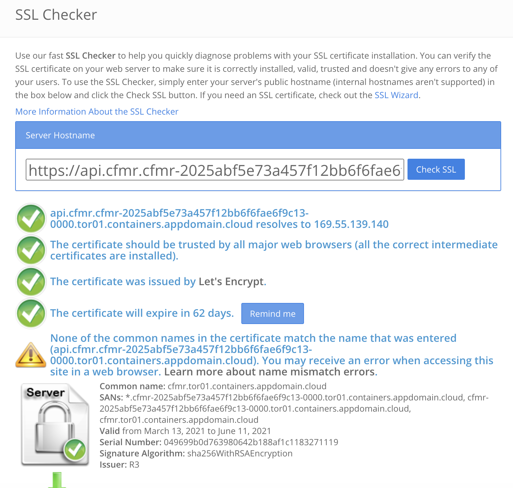
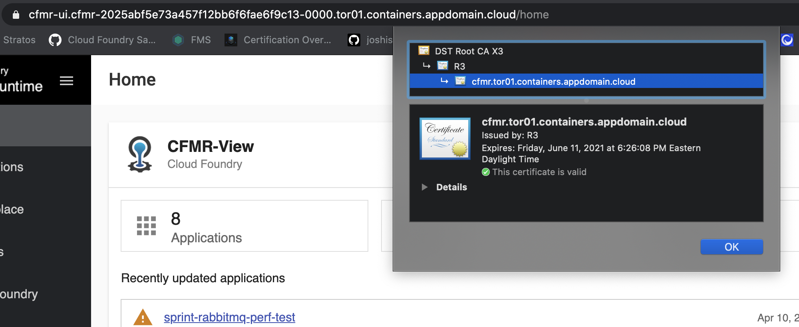

## CFMR Control Plain SSL Cert Swap

### Step 1 - Extract the ca.crt from CFMR's secret
```
oc get secret var-router-ssl -n cfmr -o json -o=jsonpath="{.data.ca}" | base64 --decode | sed -ne '/-BEGIN CERTIFICATE-/,/-END CERTIFICATE-/p' > ca.crt
```
### Step 2:  Backup and Delete the existing route
```
oc get route router -n cfmr -oyaml > coreapi.yaml
oc delete route router -n cfmr
```
### Create new reencrypted route 
```
oc create route reencrypt router -n cfmr --hostname router.cfmr.cfmr-2025abf5e73a457f12bb6f6fae6f9c13-0000.tor01.containers.appdomain.cloud --insecure-policy Redirect --service router --port router-ssl --dest-ca-cert ./ca.crt --wildcard-policy="Subdomain"
```

This gives you ...

```
▶ oc get routes
NAME            HOST/PORT                                                                                     PATH   SERVICES   PORT         TERMINATION            WILDCARD
router          router.cfmr.cfmr-2025abf5e73a457f12bb6f6fae6f9c13-0000.tor01.containers.appdomain.cloud              router     router-ssl   reencrypt/Redirect     Subdomain
```



## CFMR UI Cert Swap 
CFMR UI Cert Swap is even easier.  No need to change route ... just updated the underlying secret `cfmr-ui-cert` and scaled down/up the stratos deploy (e.g. oc scale deploy --replicas=0, ... =1).

Here's the recipe:
### Step 1 - Extract the ROKS Edge Generated Certificate and Private Key (or use the domain cert that you own)
```
oc get secret cfmr-2025abf5e73a457f12bb6f6fae6f9c13-0000 -n ibm-cert-store -o json -o=jsonpath="{.data.tls\.key}" | base64 --decode | sed -ne '/-BEGIN RSA PRIVATE KEY-/,/-END RSA PRIVATE KEY-/p' > certstore-tls.key

oc get secret cfmr-2025abf5e73a457f12bb6f6fae6f9c13-0000 -n ibm-cert-store -o json -o=jsonpath="{.data.tls\.crt}" | base64 --decode | sed -ne '/-BEGIN CERTIFICATE-/,/-END CERTIFICATE-/p' > certstore-tls.crt
```

### Step 2 - Backup and Delete existing Stratos UI Cert Secret
```
oc get secret cfmr-ui-cert -n cfmr-ui -o json > cfmr-ui-cert-orig.json
oc delete secret cfmr-ui-cert -n cfmr-ui
```

### Step 3 - Create new secret using extracted ROKS Edge Certificate and Private Key and Scale down/up stratos deploy
```
oc create secret tls cfmr-ui-cert --key=certstore-tls.key --cert=certstore-tls.crt -n cfmr-ui
oc scale deploy stratos --replicas=0
oc scale deploy stratos --replicas=1
```

Here's the results:


