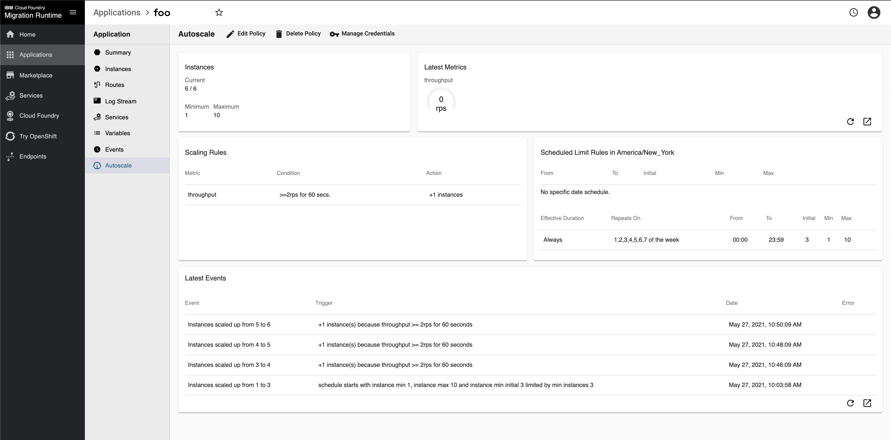

## Overview

The CFMR App Auto-Scaler automatically adjust the instance number of Cloud Foundry applications through

* Dynamic scaling based on application performance metrics
* Scheduled scaling based on time

The Cloud Foundry `Admin or Space Developers role` is needed to manage the autoscaling policy, query metric values and scaling events.  

App-AutoScaler can be offered as either a Cloud Foundry service or an extension of your Cloud Foundry platform. 

>For IBM Cloud Foundry Migration Runtime, App-Autoscaler is offered only as an extension of the product platform.

- As a Cloud Foundry platform extension: When App AutoScaler is offered as Cloud Foundry platform extension, you don't need to connect your application to autoscaler.

- As a Cloud Foundry service: When App AutoScaler is offered as a Cloud Foundry service via open service broker api , you need to provision and bind App AutoScaler service through Cloud Foundry CLI first.  This approach is unnecessary for CFMR.


## Getting started with AutoScaler CLI
* Install AutoScaler CLI plugin

 ##### From CF-Community
```
cf install-plugin -r CF-Community app-autoscaler-plugin
```
 ##### From source code
```
$ git clone git@github.com:cloudfoundry-incubator/app-autoscaler-cli-plugin.git
$ cd app-autoscaler-cli-plugin
$ git submodule update --init --recursive
$ source .envrc
$ scripts/build
$ cf install-plugin out/ascli
```
* Set App AutoScaler API endpoint （Optional)
    
  AutoScaler CLI plugin interacts with `App AutoScaler` through an API.  
	
  By default, `App AutoScaler` API endpoint is set to `https://autoscaler.<cfmr-domain>` automatically.  However, you can change it to other endpoints using the command below.
  ``` 
  cf autoscaling-api https://autoscaler.<cfmr.example.domain>
  ```
  
* Attach a Policy to an CFMR Application named: `foo`

 ```
cf attach-autoscaling-policy foo sample-policy.json
where sample-policy.json is constructed similar to this:
--start json snippet--
{
  "instance_min_count": 1,
  "instance_max_count": 10,
  "scaling_rules": [
    {
      "metric_type": "throughput",
      "breach_duration_secs": 60,
      "threshold": 2,
      "operator": ">=",
      "cool_down_secs": 60,
      "adjustment": "+1"
    }
  ],
  "schedules": {
    "timezone": "America/New_York",
    "recurring_schedule": [
      {
        "start_time": "00:00",
        "end_time": "23:59",
        "days_of_week": [
          1,
          2,
          3,
          4,
          5,
          6,
          7
        ],
        "instance_min_count": 1,
        "instance_max_count": 10,
        "initial_min_instance_count": 3
      }
    ]
  }
}
```

* View Policy

 ```
cf autoscaling-policy foo
Retrieving policy for app foo...
{
	"instance_min_count": 1,
	"instance_max_count": 10,
	"scaling_rules": [
		{
			"metric_type": "throughput",
			"breach_duration_secs": 60,
...
```
* Query Metrics

 ```
cf autoscaling-metrics foo throughput
Retrieving aggregated throughput metrics for app foo...
Metrics Name     	Value     	Timestamp
throughput       	0rps      	2021-05-27T13:45:29-04:00
throughput       	0rps      	2021-05-27T13:44:49-04:00
throughput       	0rps      	2021-05-27T13:44:09-04:00
...
```
* Query AutoScaling History and Events

 ```
cf autoscaling-history foo
Retrieving scaling event history for app foo ...
Scaling Type     	Status        	Instance Changes     	Time                          	Action                                                       	Error
dynamic          	succeeded     	5->6                 	2021-05-27T10:50:09-04:00     	+1 instance(s) because throughput >= 2rps for 60 seconds
dynamic          	succeeded     	4->5                 	2021-05-27T10:48:09-04:00     	+1 instance(s) because throughput >= 2rps for 60 seconds
dynamic          	succeeded     	3->4                 	2021-05-27T10:46:09-04:00     	+1 instance(s) because throughput >= 2rps for 60 seconds
scheduled        	succeeded     	1->3                 	2021-05-27T10:03:58-04:00     	+2 instance(s) because limited by min instances 3
```

There are other commands provided by the CLI, but the above are used frequently to get started. 

Finally, there is also a GUI interface experience through the CFMR UI at the application detailed view.

 