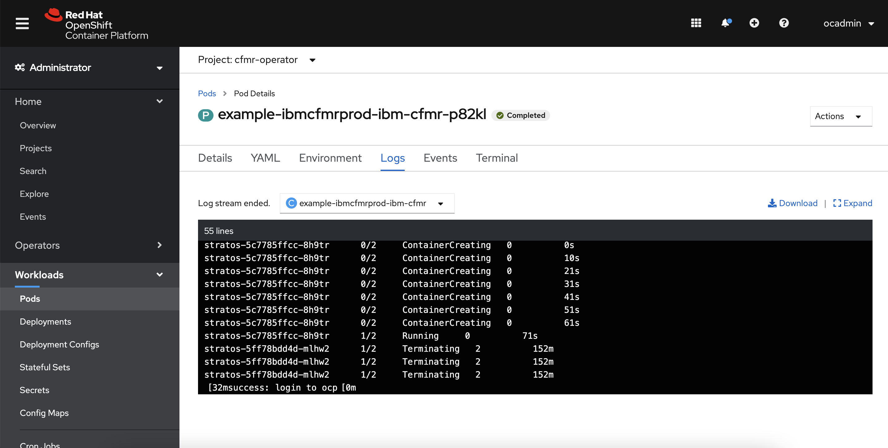
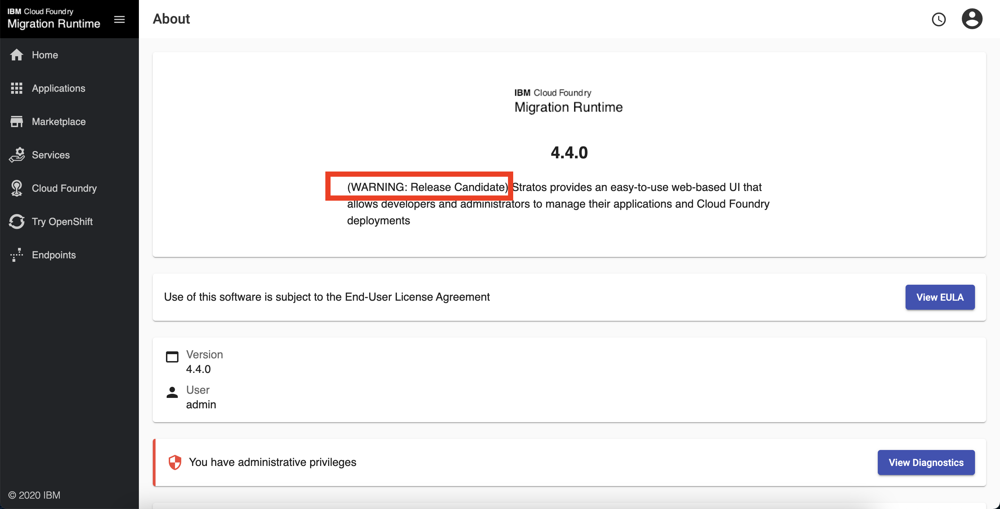
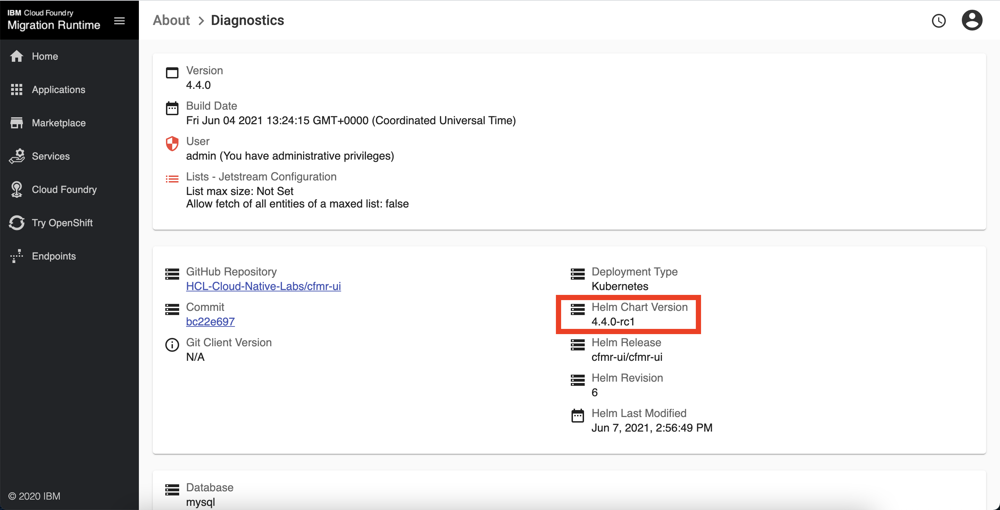
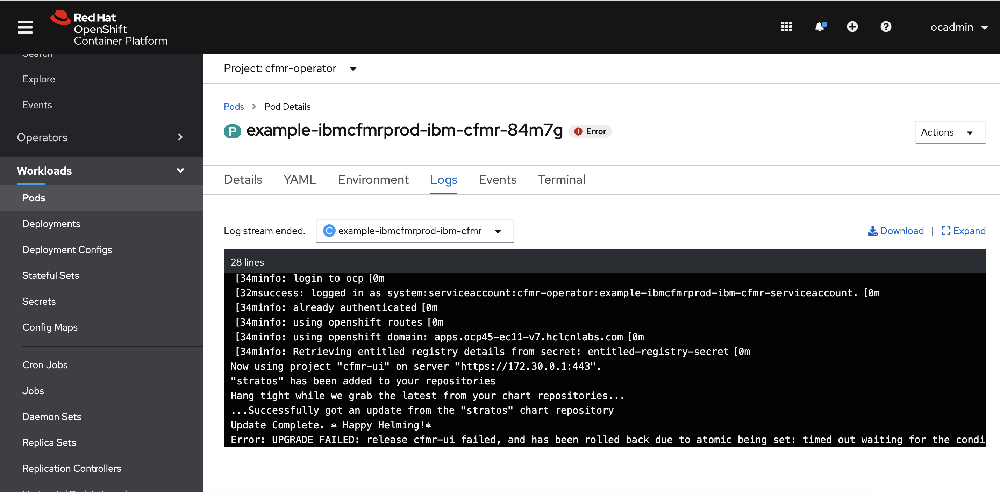

Steps needed to do an `upgrade-ui` to version `4.4.0-rc1`.

**Artifacts needed**
Stratos 4.4.0-rc1 helm chart

Images:
```
cp.stg.icr.io/cp/ibm-cfmr/cfmr-installer:1.3.1-rc1
cp.stg.icr.io/cp/ibm-cfmr/ubi-stratos-config-init:4.4.0-rc1
cp.stg.icr.io/cp/ibm-cfmr/ubi-stratos-console:4.4.0-rc1
cp.stg.icr.io/cp/ibm-cfmr/ubi-stratos-jetstream:4.4.0-rc1
cp.stg.icr.io/cp/ibm-cfmr/ubi-stratos-mariadb:4.4.0-rc1
```

**Steps**
Basically same steps as this: 

[https://www.ibm.com/docs/en/cfmr?topic=guide-upgrading](https://www.ibm.com/docs/en/cfmr?topic=guide-upgrading)

1. Update the following fields in the **original CR yaml** 
```
spec:
  action: upgrade-ui
  features:
...
    stratosVersion: 4.4.0-rc1
...
  image:
...
    tag: 1.3.1-rc1
    digest: sha256:972ae6d9ede4623ea0e289b5222be5fd19a4f0b0e429c497617e26ec1df58bdd
...
...
```
2. Delete previously applied CR for cleanup
```
$ oc delete ibmcfmrprods example-ibmcfmrprod -n cfmr-operator
ibmcfmrprod.cfmr.ibm.com "example-ibmcfmrprod" deleted
```
3. Apply updated CR yaml
```
$ oc apply -f ibm-cfmr/inventory/cfmrOperator/files/cfmr.ibm.com_v2_ibmcfmrprod_cr.yaml
ibmcfmrprod.cfmr.ibm.com/example-ibmcfmrprod created
```
4.a. When done, job pod should say 'Completed':


Console pod under cfmr-ui should have updated image versions:


Refresh UI, and under 'About', should say `(Warning: Release Candidate)` in description 


Under 'About > Diagnostics', should state updated helm chart used


4.b. If upgrade fails, it should rollback to previous version, and job pod is in 'Error' state


