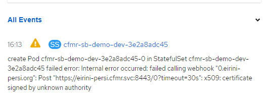
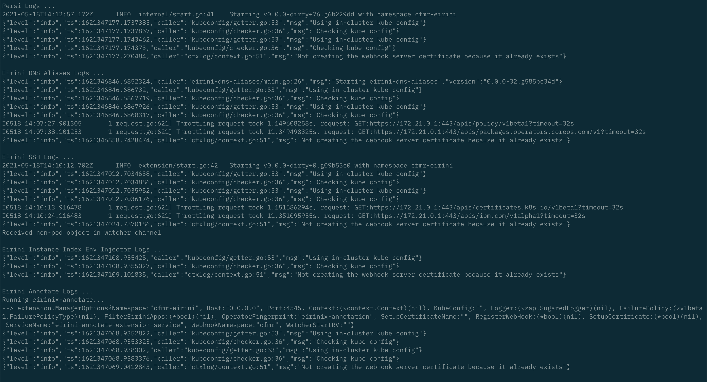
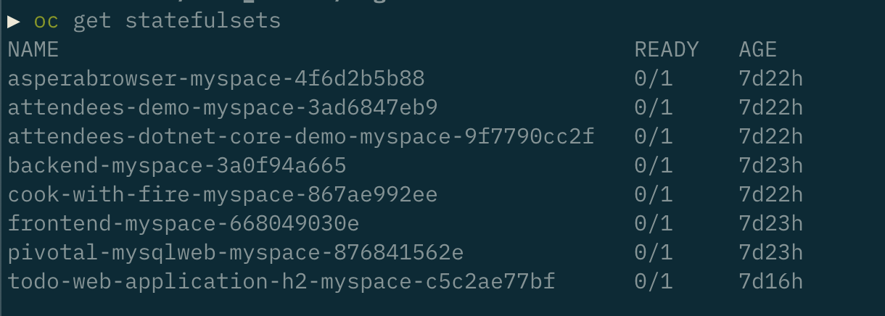
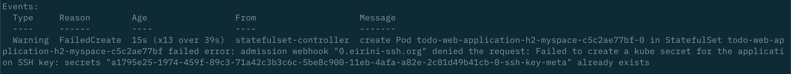

#### Background
As a result of a cluster restart, certain CFMR pods dynamically regenerate assets such as mutatingwebhookconfigurations and secrets.  Unfortunately, if a cluster is shutdown - the pods restart - however the existing assets are not overwritten.  This results in a mismatched (out-of-synch) condition.  We'll be opening an issue with dev to improve this experience.  We think linking the ownership of these resources to their parent owning deploy or pod could cause the K8s GC to cleanup these out-of-synch resources during cluster shutdown automatically.  

#### Decreasing the sensitivity to warnings on the mutatingwebhookconfiguration

```
oc -n cfmr patch mutatingwebhookconfiguration eirini-persi-mutating-hook --type=JSON -p '[{"op":"replace","path":"/webhooks/0/failurePolicy","value":"Ignore"}]'
```

Reference:  [https://kubernetes.io/docs/reference/access-authn-authz/extensible-admission-controllers/#failure-policy](https://kubernetes.io/docs/reference/access-authn-authz/extensible-admission-controllers/#failure-policy)


#### Re-synchronize (regenerate) the webhook certificates, keys and CAs and the setup secret with the `persi` deployment (running cluster)

```
#!/bin/bash
# ----------------------------------------------------------------------------------------------------\\
# Description:
#   A script to resynchronize CFMR webhook client certs, keys and CAs after a cluster restart
#
#   Options:
#     None
#
#   Example:
#     ./resynch-cfmr-eirini-certs.sh
#
#   Reference: None
#
# ----------------------------------------------------------------------------------------------------\\
set -e
# Scale Pertinent Deployments to 0 replicas
oc -n cfmr scale deploy persi --replicas=0
oc -n cfmr scale deploy eirini-dns-aliases --replicas=0
oc -n cfmr scale deploy ssh --replicas=0
oc -n cfmr scale deploy instance-index-env-injector --replicas=0
oc -n cfmr scale deploy eirini-annotate-extension --replicas=0


# Remove cluster scoped mutatingwebhookconfiguration with stale client config
oc delete mutatingwebhookconfigurations eirini-persi-mutating-hook 
oc delete mutatingwebhookconfigurations eirini-dns-aliases-mutating-hook
oc delete mutatingwebhookconfigurations eirini-ssh-mutating-hook
oc delete mutatingwebhookconfigurations eirini-x-mutating-hook
oc delete mutatingwebhookconfigurations eirinix-annotation-mutating-hook


# Remove stale *-setupcertificates
oc -n cfmr delete secret eirini-persi-setupcertificate
oc -n cfmr delete secret eirini-dns-aliases-setupcertificate
oc -n cfmr delete secret eirini-ssh-setupcertificate
oc -n cfmr delete secret eirini-x-setupcertificate
oc -n cfmr delete secret eirinix-annotation-setupcertificate

# Regenerate new synchronized certificates and client configs for the mutatingwebhookconfiguration
oc -n cfmr scale deploy persi --replicas=1
oc -n cfmr scale deploy eirini-dns-aliases --replicas=1
oc -n cfmr scale deploy ssh --replicas=1
oc -n cfmr scale deploy instance-index-env-injector --replicas=1
oc -n cfmr scale deploy eirini-annotate-extension --replicas=1

# Validate
oc get mutatingwebhookconfiguration eirini-persi-mutating-hook
oc get mutatingwebhookconfigurations eirini-dns-aliases-mutating-hook
oc get mutatingwebhookconfigurations eirini-ssh-mutating-hook
oc get mutatingwebhookconfigurations eirini-x-mutating-hook
oc get mutatingwebhookconfigurations eirinix-annotation-mutating-hook

oc -n cfmr get secret eirini-persi-setupcertificate
oc -n cfmr get secret eirini-dns-aliases-setupcertificate
oc -n cfmr get secret eirini-ssh-setupcertificate
oc -n cfmr get secret eirini-x-setupcertificate
oc -n cfmr get secret eirinix-annotation-setupcertificate

# echo "Persi Logs ..."
oc -n cfmr logs -l app.kubernetes.io/component=persi

# echo "Eirini DNS Aliases Logs ..."
oc -n cfmr logs -l app.kubernetes.io/component=eirini-dns-aliases

# echo "Eirini SSH Logs ..."
oc -n cfmr logs -l app.kubernetes.io/component=ssh

# echo "Eirini Instance Index Env Injector Logs ..."
oc -n cfmr logs -l app.kubernetes.io/component=instance-index-env-injector

# echo "Eirini Annotate Logs ..."
oc -n cfmr logs -l app.kubernetes.io/name=eirini-annotate-extension
```

#### Protecting for the future - illustration
```
# Example to illustrate how to relate the mutatingwebhookconfigs and secrets to their parent pod.  Thus, when the pods die (e.g. cluster restart)- the webhookconfigurations and secrets also go away.  A full script "future-proof-*" has also been created.

oc get pods -l app.kubernetes.io/component=persi -o go-template="{{range .items}}\"\"kubectl patch mutatingwebhookconfiguration eirini-persi-mutating-hook -n cfmr --type=JSON -p '[{\"op\":\"add\",\"path\":\"/metadata/ownerReferences\",\"value\":[{\"apiVersion\":\"v1\",\"blockOwnerDeletion\":false,\"controller\":true,\"kind\":\"Pod\",\"name\":\"{{.metadata.name}}\",\"uid\":\"{{.metadata.uid}}\"}]}]'\"\"{{\"\n\"}}{{end}}" | xargs -0 -L1 sh -c

# RESULT: mutatingwebhookconfiguration.admissionregistration.k8s.io/eirini-persi-mutating-hook patched

oc get pods -l app.kubernetes.io/component=persi -o go-template="{{range .items}}\"\"kubectl patch secret eirini-persi-setupcertificate -n cfmr --type=JSON -p '[{\"op\":\"add\",\"path\":\"/metadata/ownerReferences\",\"value\":[{\"apiVersion\":\"v1\",\"blockOwnerDeletion\":false,\"controller\":true,\"kind\":\"Pod\",\"name\":\"{{.metadata.name}}\",\"uid\":\"{{.metadata.uid}}\"}]}]'\"\"{{\"\n\"}}{{end}}" | xargs -0 -L1 sh -c

# RESULT: secret/eirini-persi-setupcertificate patched
```

#### Handy Restart one-liners

```
# Scale all cf apps down
cf apps | sed 1,5d | awk '{print $1}' | xargs -I{} cf scale {} -i 0

# Remove all stale ssh-key-meta secrets
oc get secrets -n cfmr-eirini | grep ssh-key-meta | awk '{print $1}' | xargs -I{} oc delete secret {} -n cfmr-eirini

# Apply cronjob ssh-key-meta re-parenting
oc apply -f /path/to/cron-ssh-key-meta-re-parenting.yaml

# Rescale all cf apps up
cf apps | sed 1,5d | awk '{print $1}' | xargs -I{} cf scale {} -i 1
```


#### Troubleshooting tips
Example Logs from Eirini-Persi Pod

```
▶ oc logs persi-6ff46f54cd-z6knj
2021-05-03T16:25:54.303Z	INFO	internal/start.go:41	Starting v0.0.0-dirty+76.g6b229dd with namespace cfmr-eirini
{"level":"info","ts":1620059154.3038177,"caller":"kubeconfig/getter.go:53","msg":"Using in-cluster kube config"}
{"level":"info","ts":1620059154.3038573,"caller":"kubeconfig/checker.go:36","msg":"Checking kube config"}
{"level":"info","ts":1620059154.30802,"caller":"kubeconfig/getter.go:53","msg":"Using in-cluster kube config"}
{"level":"info","ts":1620059154.3081286,"caller":"kubeconfig/checker.go:36","msg":"Checking kube config"}
{"level":"info","ts":1620059154.9382117,"caller":"ctxlog/context.go:51","msg":"Creating webhook server certificate"}
```

Symptoms







